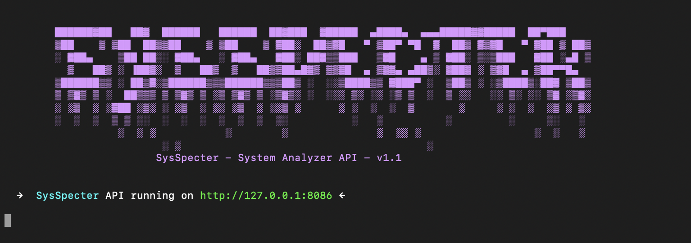

# SysSpecter
<div align="center">
  
  
  
</div>

<div align="center">
  
  
  <a url="https://pkg.go.dev/github.com/valyala/fasthttp"></a>
  
  
  
</div>

<!-- PROJECT LOGO -->
<br />
<div align="center">
  <a href="https://github.com/aDarkDev/SysSpecter">
    
  </a>

  <h3 align="center">SysSpecter</h3>

  <p align="center">
    Welcome to SysSpecter - System Analyzer API for linux!
    <br />
    <br />
    ·
    <a href="https://github.com/aDarkDev/SysSpecter/issues">Report Bug</a>
    ·
    <a href="https://github.com/aDarkDev/SysSpecter/issues">Request Feature</a>
  </p>
</div>

SysSpecter is a comprehensive tool designed to monitor and report various aspects of network traffic and system status. It offers real-time insights into network connections, interface lists, system performance, memory usage, disk space, and more, making it an invaluable resource for system administrators and network engineers.

## Features

- **Network Traffic Analysis**: Monitor incoming and outgoing network traffic, including bytes, packets, errors, and dropped packets.
- **System Health Monitoring**: Keep tabs on the overall status of your system, including memory usage and disk space.
- **Real-Time Updates**: Get per-second updates on network traffic to identify potential issues promptly.


To install SysSpecter, clone this repository to your local machine:

```bash
git clone https://github.com/aDarkDev/SysSpecter.git
cd SysSpecter
```

next install golang:

```bash
sudo apt install golang-go
```

next install require libraries:

```bash
go mod tidy
```

ًRun: 
```bsah
sudo go run .
```

<div align="center">
  
</div>

Or you can use latest compiled file from [here](https://github.com/aDarkDev/SysSpecter/releases)
## Usage

After installation, you can start the SysSpecter service. Here are some examples of how to use the available endpoints:


### Get Network Traffic per Second

```bash
curl http://localhost:port/network/traffic/per_second
```

Example Response:
```json
{"incoming": 2.51,"outgoing": 0.21}
```
### List Network Interfaces

```bash
curl http://localhost:port/network/interface_list
```

Example Response:
```json
["docker0","lo","nekoray-tun","wlo1"]
```

### Get Network Connections

```bash
curl http://localhost:port/network/connections
```

Example Response:
```json
[
    {
        "dest_ip": "127.0.0.1",
        "dest_port": "8877",
        "source_ip": "127.0.0.1",
        "source_port": "53492",
        "protocol":"tcp"
    },
    {
        "dest_ip": "142.250.185.66",
        "dest_port": "443",
        "source_ip": "172.19.0.1",
        "source_port": "41714",
        "protocol":"tcp"
    }
    ...
]
```

### System Status

```bash
curl http://localhost:port/system/status
```

Example Response:
```json
{
    "cpu_count": 8,
    "cpu_usage": 5.569620253177614,
    "mem_size": 15685.328125,
    "mem_usage": 25.0707020195027,
    "uptime_int": 39155,
    "uptime_str": "0 day(s) 10 hour(s) 52 min(s)"
}
```

### Memory info

```bash
curl http://localhost:port/system/memory
```

Example Response:
```json
{
    "mem_alloc": 974296,
    "mem_heap_alloc": 974296,
    "mem_size": 15685.328125,
    "mem_swap": 1024454656,
    "mem_sys": 13781776,
    "mem_total_alloc": 3719680
}
```

### Disks info

```bash
curl http://localhost:port/system/disks
```

Example Response:
```json
{
    "/": 25.907221257048235,
    "/boot/efi": 36.42069498697917,
    "/dev": 0,
    "/dev/hugepages": 0,
    "/dev/mqueue": 0,
    "/dev/pts": 0,
    "/dev/shm": 0.8571405802197716,
    "/home/ghost": 25.907221257048235,
    "/proc": 0,
    "/proc/sys/fs/binfmt_misc": 0,
    "/run": 0.6352961685489796,
    "/run/credentials/systemd-sysusers.service": 0,
    "/run/lock": 0.078125,
    "/run/user/1000": 0.009214432291355368,
    "/run/user/1000/doc": 0,
    "/run/user/1000/gvfs": 0,
    "/snap/code/149": 100,
}
```

### Network Traffic graph

- `curl http://localhost:port/network/traffic/graph`
- Html live graph, open in browser: `http://localhost:port/network/traffic/live_graph`


### Incoming Network Traffic

- **Bytes**: `curl http://localhost:port/network/incoming/bytes?interface=<interface>`
- **Packets**: `curl http://localhost:port/network/incoming/packets?interface=<interface>`
- **Errors**: `curl http://localhost:port/network/incoming/errors?interface=<interface>`
- **Dropped**: `curl http://localhost:port/network/incoming/dropped?interface=<interface>`

### Outgoing Network Traffic

- **Bytes**: `curl http://localhost:port/network/outgoing/bytes?interface=<interface>`
- **Packets**: `curl http://localhost:port/network/outgoing/packets?interface=<interface>`
- **Errors**: `curl http://localhost:port/network/outgoing/errors?interface=<interface>`
- **Dropped**: `curl http://localhost:port/network/outgoing/dropped?interface=<interface>`

## Contributing

Contributions are what make the open-source community such an amazing place to learn, inspire, and create. Any contributions you make are **greatly appreciated**.

1. Fork the Project
2. Create your Feature Branch (`git checkout -b feature/AmazingFeature`)
3. Commit your Changes (`git commit -m 'Add some AmazingFeature'`)
4. Push to the Branch (`git push origin feature/AmazingFeature`)
5. Open a Pull Request

## License

Distributed under the MIT License. See `LICENSE` for more information.

## Contact

Your aDarkDev – aDarkDevsup@gmail.com

Project Link: [https://github.com/aDarkDev/SysSpecter](https://github.com/aDarkDev/SysSpecter)

